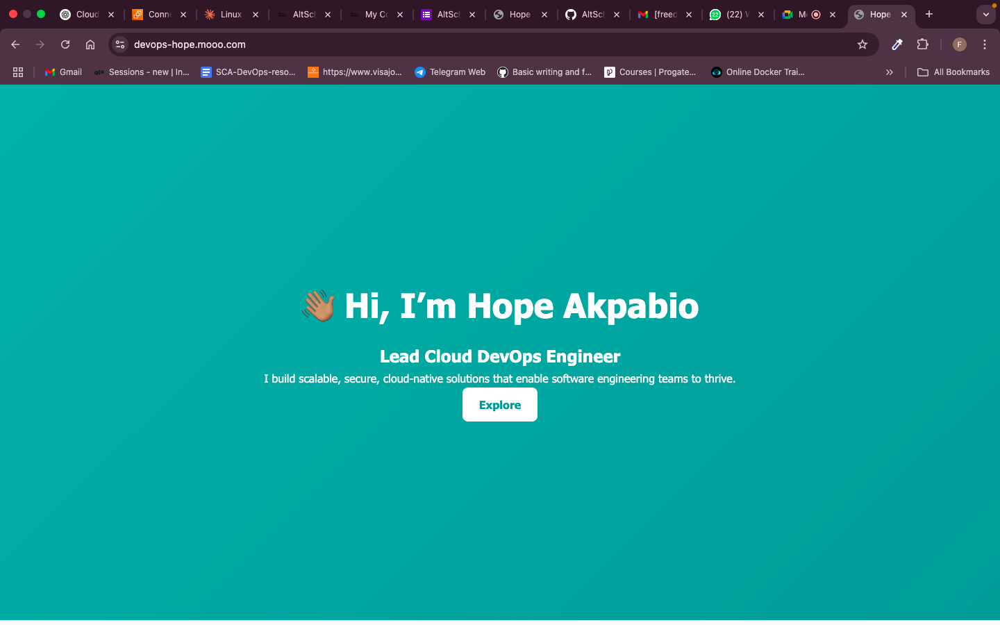

# DevOps Project: Node.js App Deployment on EC2 with Nginx, Domain, and HTTPS

This project demonstrates how to deploy a simple Node.js application on an Ubuntu EC2 server using Nginx as a reverse proxy setting up a custom domain with HTTPS, and managing the application using PM2. It is part of the second semester examination project for the Cloud Engineering track at **AltSchool Africa**.

---
## Steps:

### Step 1: Launch and Configure EC2 Instance

- Launched an Ubuntu EC2 instance on AWS using the AWS Console.
- Chose security groups that allowed access on ports **22 (SSH)**, **80 (HTTP)**, and **443 (HTTPS)**.
- Created and downloaded a `.pem` key pair for SSH access.

---

### Step 2: Connect to EC2 via SSH
On the terminal:
- chmod 400 my-key.pem
- ssh -i "my-key.pem" ubuntu@your-ec2-public-ip

### Step 3: Server Setup (Ubuntu)
Updated and upgraded packages:
- sudo apt update
- sudo apt upgrade -y

### Step 4: Installed Node.js and npm:
- sudo apt install -y nodejs
Installed Git and cloned the app (or copied via SCP):

copied local files using:

scp -i my-key.pem index.html ubuntu@your-ec2-public-ip:~/myapp/

### Step 5: Install and Configure Nginx
- sudo apt install nginx
- sudo systemctl enable nginx
- sudo systemctl start nginx
  
### Step 6: Created a reverse proxy config for the app in /etc/nginx/sites-available/startup-app:
server {
    listen 80;
    server_name your-domain.com;

    location / {
        proxy_pass http://localhost:3000;
        proxy_http_version 1.1;
        proxy_set_header Upgrade $http_upgrade;
        proxy_set_header Connection 'upgrade';
        proxy_set_header Host $host;
        proxy_cache_bypass $http_upgrade;
    }
}

### Step 7: Enabled the config and restarted Nginx:
- sudo nginx -t
- sudo systemctl restart nginx
  
### Step 8: Tested the Node.js app locally and Checked connectivity:
cd ~/myapp
node app.js
curl http://localhost:3000
curl http://your-ec2-public-ip

### Step 9: Installed PM2:
- sudo npm install pm2
- pm2 start app.js --name "startup-app"
- pm2 save
- pm2 startup

### Step 10: Registered a free domain at FreeDNS.
- Added an A record pointing to the EC2 public IP.
- Domain: https://devops-hope.mooo.com/

### Step 11: Enable HTTPS with Certbot
Installed Certbot and Nginx plugin:
- sudo snap install --classic certbot
- sudo certbot --nginx -d devops-hope.mooo.com

✅ Final Check
Accessed the app via:
🔗 https:/devops-hope.mooo.com
Public IP Address: http://54.154.187.71

Ensured Node.js is running behind Nginx, secured with SSL, and managed by PM2.

📸 Screenshot

👩🏽‍💻 Author
Hope Akpabio
Cloud Engineer | AltSchool Africa
📧 futurehopesaviour@gmail.com
